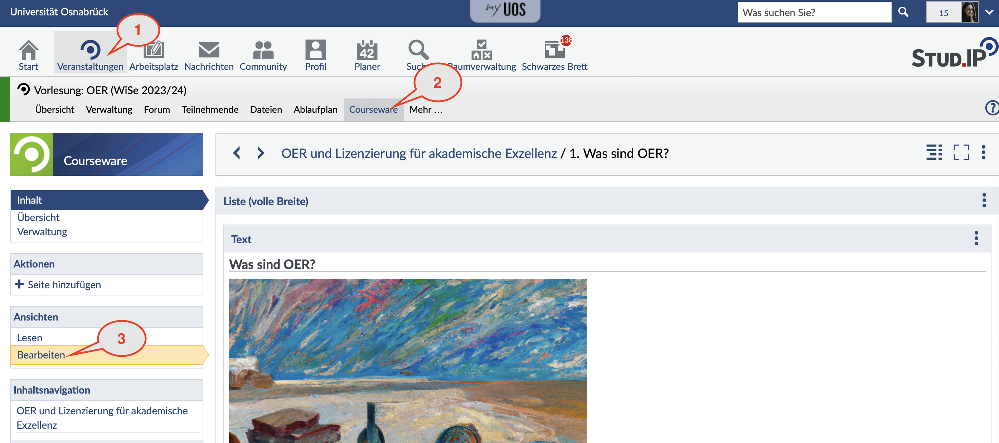
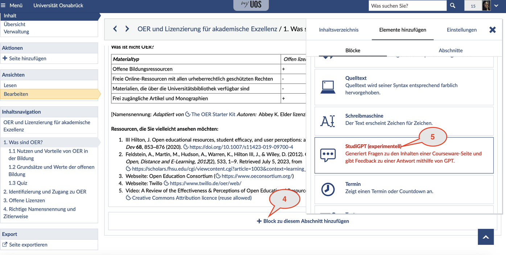
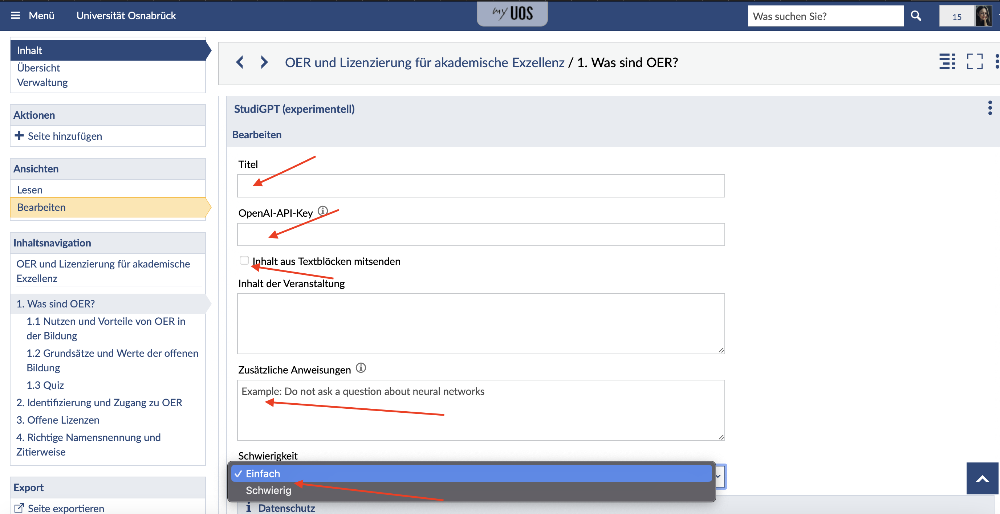
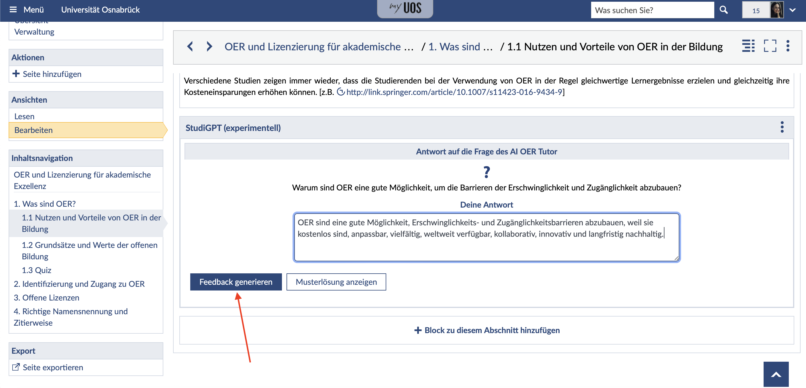
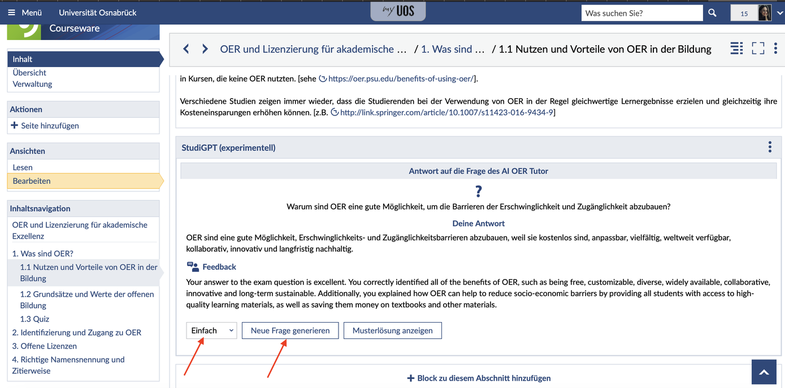

# StudiGPT

Courseware-Block zur Generierung von Fragen und Feedback zu Antworten basierend auf dem Inhalt einer Courseware-Seite. Derzeit wird das große Sprachmodell GPT-3 von openAI für die Generierung der Fragen und die Auswertung verwendet.

## Nutzung
Der StudiGPT-Block generiert aus Textblöcken (Text, Source Code, Typewriter, Learning Cards, Headline, Keypoint) maßgeschneiderte Fragen auf Basis der Kursinhalte und ermöglicht den Studierenden eine aktive Auseinandersetzung mit dem Kursmaterial. Dozierende haben die Flexibilität, sowohl bestimmte Abschnitte als auch den gesamten Inhalt einer Seite auszuwählen, um die entsprechenden Fragen zu erstellen. Das Tool verbessert das Behalten von Informationen und erleichtert es den Studierenden z. B. bei der Prüfungsvorbereitung ihr Wissen zu testen. Die Studierenden können mit dem System interagieren, indem es Fragen zu dem von ihnen behandelten Stoff stellt. Mithilfe einer Reihe von dynamisch generierten Fragen können die Studierenden ihr Verständnis der zu lernenden Konzepte testen. Studierende / Schüler*innen können so in ihrem eigenen Tempo lernen und erhalten nach der Beantwortung der Fragen ein sofortiges Feedback und Erklärungen, die es ihnen ermöglichen Wissenslücke zu identifizieren und durch weitere Übungen zu schließen. Dieses Echtzeit-Feedback erleichtert die kontinuierliche Verbesserung und hilft den Schülern, ihre Lernziele zu erreichen. Außerdem kann man eine Musterlösung einsehen und das Programm wie ein klassiches Karteikartendeck benutzen, jedoch mit Lerninhalten, die in Echtzeit durch die KI generiert werden.

Für die Nutzung des StudiGPT Plugin ist ein API-Schlüssel von OpenAI erforderlich. Wir arbeiten aktiv daran, diese Abhängigkeit zu minimieren, und auch die Verwendung anderes Large Language Models (LLMs) in naher Zukunft zu ermöglichen.

StudiGPT ist nicht dazu gedacht, traditionelle Lernmethoden zu ersetzen. Vielmehr ergänzt es als Werkzeug die bestehenden pädagogischen Ansätze, indem es den Studierenden eine innovative und interaktive Möglichkeit bietet ihr Lernen zu festigen und ihr Wissen zu prüfen.
Um das Tool zu nutzen, befolgen Sie die bitte diese Schritte:

Nachdem Sie den StudiGPT-Block in Courseware hinzugefügt haben, wird er im Bearbeitungsmodus angezeigt. Er erfordert einen Titel und den OpenAI-Schlüssel.
Der nächste Schritt ist das Hinzufügen des Kursinhalts (dieser kann die gesamte Seite oder nur ein Teil davon enthalten). Danach können Sie zusätzliche Anweisungen hinzufügen, eine Schwierigkeit wählen und die Daten speichern.

Dann wird der Block im Lesemodus dargestellt. Hier werden Sie aufgefordert, die Nutzungsbedingungen zu akzeptieren.

Wenn Sie zustimmen und eine Frage generieren, können Sie Ihre Antwort eingeben, eine Rückmeldung zu Ihrer Antwort erhalten und bei Bedarf die von der KI bereitgestellte Musterlösung ansehen. 

Anschließend können Sie erneut den Schwierigkeitsgrad für die neue Frage auswählen und sie erstellen.

## Konfiguration

Die Konfigurationen befinden sich auf der Adminoberfläche unter `Admin->Konfiguration->Globale Konfiguration->-Ohne Kategorie-`

Die folgenden Konfigurationen sind verfügbar:

| Name                           | Description                                                                                                                                                                     |
|--------------------------------|---------------------------------------------------------------------------------------------------------------------------------------------------------------------------------|
| COURSEWARE_GPT_QUESTION_PROMPT | Prompt, der an die OpenAI-API gesendet wird, um ein Feedback auf eine Antwort zu generieren. Der Prompt unterstützt Stud.IP internes Templating, siehe Abschnitt Templating.    |
| COURSEWARE_GPT_FEEDBACK_PROMPT | Prompt, der an die OpenAI-API gesendet wird, um eine Frage und eine Musterlösung zu generieren. Der Prompt unterstützt Stud.IP internes Templating, siehe Abschnitt Templating. |

## Templating

Die Bibliothek `exTpl` wird für das Parsen der Templates verwendet.

### Unterstützte Platzhalter

Dieser Abschnitt listet alle verfügbaren Platzhalter für die einzelnen Prompts auf.

Platzhalter in `COURSEWARE_GPT_QUESTION_PROMPT`:

| Name                      | Description                                                                               |
|---------------------------|-------------------------------------------------------------------------------------------|
| `title`                   | Der Kurstitel, wenn ein Kurskontext vorhanden ist. Ansonsten der Titel des Lernmaterials. |
| `summary`                 | Die Zusammenfassung des Blocks                                                            |
| `difficulty`              | Die ausgewählte Schwierigkeit                                                             |
| `questions`               | Die zuvor generierten Fragen                                                              |
| `additional_instructions` | Die zusätzlichen Anweisungen des Blockerstellers                                          |

Platzhalter in `COURSEWARE_GPT_FEEDBACK_PROMPT`:

| Name       | Description              |
|------------|--------------------------|
| `question` | Die beantwortete Frage   |
| `answer`   | Die Antwort des Nutzers  |
| `solution` | Die Musterlösung von GPT |

### Beispiele
Mehr Beispiele können im [Stud.IP-Code](https://gitlab.studip.de/studip/studip) unter `vendor/exTpl/template_test.php` gefunden werden.

#### Einfache Platzhalter
Template: `The difficulty of the questions should be: {{ difficulty }}`

Der Platzhalter `difficulty` wird durch die gewählte Schwierigkeit ersetzt.

#### Bedingungen
Template: `{{ if questions != "" }} Questions are set {{ else }} No questions are set {{ endif }}`

## Mitwirkende
Dieses Plugin basiert auf Ideen aus einer prototypisch entwickelten Webanwendung von den Studenten [Maximilian Kalcher (mklacher@uos.de)](mailto:mklacher@uos.de) und [Konstantin Strömel (kstroemel@uos.de)](mailto:kstroemel@uos.de). Sie beteiligten sich mit ihrer Expertise bei der Anwendung von Large Language Models, um die Generierung von Fragen, Musterlösungen und Feedback durch Prompt Engineering zu ermöglichen. Außerdem stellten sie Anforderungen an die Bedienoberfläche und die Funktionalitäten und wirkten so an der Umsetzung dieses Projektes mit. Die beiden können gerne bei allgemeinen Fragen zur Anwendung von generativer KI für Lernanwendungen kontaktiert werden, sowie spezifischen Fragen zum Einsatz von LLMs und Prompt Engineering. Außerdem sind sie offen für Vorschläge zu neuen Features oder Kollaborationen, um diese gemeinsam umzusetzen.

Die technische Entwicklung wird vom Zentrum virtUOS der Universität Osnabrück ausgeführt. Falls Fragen zur Nutzung des Plugins in Courseware oder zu möglichen Erweiterungen auftreten, können [Dennis Benz (debenz@uos.de)](mailto:debenz@uos.de) und [Lars Kiesow (lkiesow@uos.de)](mailto:lkiesow@uos.de) per Mail erreicht werden. Bei technischen Fragen oder Problemen können [Issues](https://github.com/virtUOS/StudiGPT/issues) erstellt werden.
